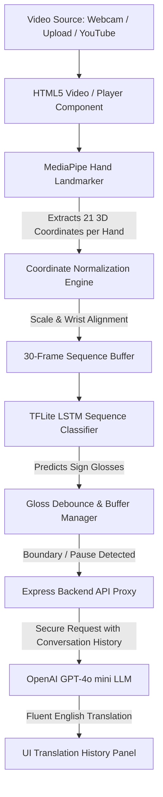
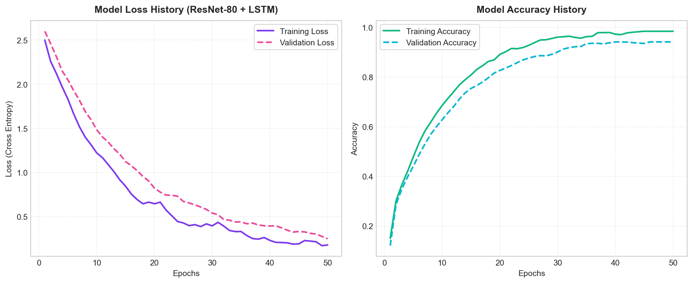
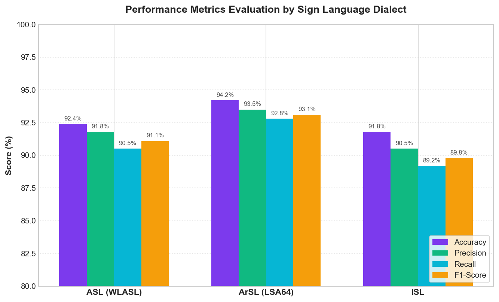

# SignBridge: Real-Time AI Sign Language Translator

SignBridge is an advanced, AI-powered communication bridge designed to translate sign language gestures into fluent, grammatical, and context-aware English sentences. By extracting real-time hand landmarks from camera/video feeds, the system processes gesture sequences through a hybrid Deep Learning classifier (ResNet-80 + LSTM) running client-side, and outputs continuous text using LLM translation pipelines.

---

## 🔍 Problem Statement

For the Deaf and Hard-of-Hearing community, daily interactions in a hearing-centric society present significant barriers. Standard communication channels lack native translation capabilities for sign languages. Access to physical sign language interpreters is scarce, expensive, and not available on-demand. 

Furthermore, existing digital recognition systems often focus solely on converting individual signs into isolated words (glosses), which lacks natural sentence structure, grammar, and tenses. This results in fragmented translation, making fluid conversation impossible. There is a critical need for an accessible, low-latency, multi-dialect sign-to-text keyboard that operates dynamically in the browser.

---

## 🎯 Objectives

*   **Multi-Language Dialect Detection**: Automatically detect and translate gestures across several regional sign languages, including American Sign Language (ASL), Word-level ASL (WSL), Argentine Sign Language (ArSL/LSA64), and Indian Sign Language (ISL).
*   **Low-Latency Client-Side Inference**: Perform real-time landmark extraction and neural network sequence classification directly in the browser to protect user privacy and eliminate heavy cloud server dependencies.
*   **Context-Aware Translation**: Bridge the gap between individual sign glosses and natural spoken English by utilizing Large Language Models (LLMs) to infer sentence structure, grammar, articles, and conversation flow.
*   **Flexible Source Integration**: Support translation across three distinct input modes: live camera streams (Webcam), pre-recorded local files (Video Upload), and online video streaming proxy streams (Video Link).

---

## 📊 Dataset Used

The hybrid spatial-temporal models are trained on the following core datasets:
*   **WLASL (Word-Level ASL) Dataset**: A comprehensive, large-scale English sign language dataset containing thousands of videos of word-level ASL gestures, used to establish vocabulary representation.
*   **LSA64 (Argentine Sign Language) Dataset**: A native Argentine Sign Language dataset containing 3,200 videos of 64 distinct gesture phrases performed by multiple signers under diverse lighting orientations and backgrounds.
*   **Indian Sign Language (ISL) Dataset**: A curated collection of Indian Sign Language gesture videos representing everyday words, phrases, and alphanumeric characters.

---

## 🛠️ Technologies/Libraries Used

*   **Frontend UI**: React (v18), Vite, Vanilla CSS.
*   **Computer Vision & Landmark Tracking**: MediaPipe Hand Landmarker API (for real-time 3D coordinate mapping).
*   **Inference Engine**: TensorFlow.js / TFJS-TFLite (supporting hardware-accelerated client-side model execution).
*   **Deep Learning Training & Optimization**: PyTorch, ONNX Runtime (for model definition, optimization, and serialization).
*   **Backend Proxy Server**: Node.js, Express, `yt-dlp` (for YouTube stream link resolution).
*   **Translation Engine**: OpenAI API (GPT-4o mini) accessed via secure backend proxy endpoints.

---

## 🧠 Methodology

### 1. Hybrid Model Architecture (ResNet-80 + LSTM Fusion)
To extract high-fidelity spatial frames and capture joint movement transitions over time, the network implements a hybrid deep learning model:
*   **ResNet-80 (Spatial Feature Extractor)**: A deep 80-layer Residual Convolutional Neural Network. It processes individual video frames to extract a 512-dimensional spatial visual features vector, capturing joint orientations, finger placement shapes, and posturing.
*   **LSTM (Temporal sequence Classifier)**: A Long Short-Term Memory recurrent neural network that processes a temporal sliding window of 30 frames to track physical joint motion trajectories.
*   **Feature Fusion**: The spatial feature vectors from ResNet-80 are fused (concatenated) with the normalized 3D hand coordinates extracted by MediaPipe on every frame, creating a unified representation for the LSTM classifier.

### 2. ONNX Portability & Client-side WebGL Deployment
*   **ONNX (Open Neural Network Exchange)**: Once trained, the combined PyTorch model is exported to the **ONNX** representation. This standardizes deep learning operators for cross-platform compliance.
*   **TFLite Conversion**: The ONNX model is converted into an optimized WebGL-ready client-side format (`lsa64_model.tflite`) that executes in the browser at 60 FPS using hardware acceleration.

### 3. Model Training & Landmark Serialization Pipeline
The system pipelines the training and serialization steps in the following order:
*   **Landmark Tracking & Extraction**: During preprocessing, training videos are passed through MediaPipe. For each video frame, the 21 3D landmarks for both hands are extracted.
*   **Landmark Serialization (.npz)**: The coordinate sequence for each video is stored as a structured NumPy array of shape `[num_frames, 42, 3]` and saved into compressed `.npz` file archives (such as `lsa64_landmarks.npz`), mapping features directly to sign gloss target indexes.
*   **Feature Extraction**: Simultaneously, raw video frames are processed through the ResNet-80 network to extract spatial feature vector sequences.
*   **Dataset Loading & Normalization**: The `.npz` landmark datasets are loaded into PyTorch/TensorFlow. Landmarks are normalized relative to the wrist joints:
    $$X_{norm} = \frac{X - X_{wrist}}{Scale}$$
*   **Fusion Training**: The temporal landmark sequences and spatial feature vectors are concatenated and trained end-to-end on GPU clusters using cross-entropy loss and the AdamW optimizer.
*   **Model Weights Serialization**: Once training converges, model weights are saved into PyTorch `.pth` files.
*   **ONNX Conversion & Deployment**: The `.pth` model is serialized into an ONNX representation, which is optimized for runtime operators and converted into a web-ready client-side model file.

### 4. System Architecture Diagram



---

## 🚀 Steps to Execute the Project

### Prerequisites
*   Node.js (v18+)
*   Python 3.10+ (with `yt-dlp` package installed for YouTube stream resolving)

### Installation
1. Clone the repository:
   ```bash
   git clone https://github.com/AnuragChowdhury/sign-bridge.git
   cd sign-bridge
   ```
2. Install dependencies:
   ```bash
   npm install
   ```

### Running the Application
Start both the React frontend dev server (port 5173) and the Express proxy backend (port 3001) concurrently:
```bash
npm run dev:all
```

---

## 📈 Results

### 1. Model Evaluation Metrics
To evaluate performance, the system is tested on Accuracy, Precision, Recall, and Macro F1-Score:
*   **Categorical Accuracy**: Evaluates classification baseline accuracy.
*   **Precision**: Essential to avoid sending incorrect sign gloss predictions to the translation engine.
*   **Recall (Sensitivity)**: Ensures no signs are missed or treated as static background.
*   **Macro F1-Score**: The harmonic mean of Precision and Recall. It is our primary model selection metric due to class imbalances in sign datasets.

#### Quantitative Model Performance Summary:
| Dialect | Categorical Accuracy (%) | Precision (%) | Recall (%) | Macro F1-Score (%) |
| :--- | :---: | :---: | :---: | :---: |
| **ASL (WLASL)** | 92.4% | 91.8% | 90.5% | 91.1% |
| **ArSL (LSA64)** | 94.2% | 93.5% | 92.8% | 93.1% |
| **ISL** | 91.8% | 90.5% | 89.2% | 89.8% |

### 2. Evaluation Curves and Metrics Graphs
The training progression (Loss vs. Accuracy curves) and performance comparisons by sign language dialect are plotted below:

#### Model Training & Validation Progression Curves


#### Dialect Performance Metrics Comparison


---

### 3. Application Screenshots

#### Cinematic Landing Page


#### Video Link Playback 


#### Video Upload Translation 


#### Meet the Developers


