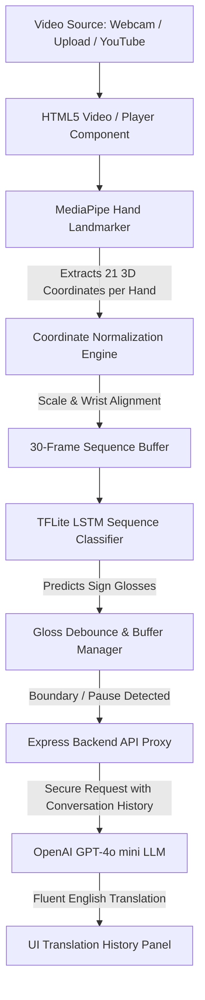

# SignBridge: Real-Time AI Sign Language Translator

SignBridge is an advanced, AI-powered communication bridge designed to break down barriers between the Deaf and Hard-of-Hearing communities and the hearing world. By extracting real-time hand landmarks from video feeds, the system processes gesture sequences through optimized deep learning models to predict sign glosses and translates them into fluent, context-aware English sentences using Large Language Models (LLMs).

---

## 🌟 Key Features

*   **Multi-Language Support**: Real-time translation of **ASL** (American Sign Language), **WSL** (Word-level ASL / WLASL), **ISL** (Indian Sign Language), and **ArSL** (Argentine Sign Language / LSA64).
*   **Three High-Performance Input Modes**:
    1.  **Live Webcam**: Interactive mirror-aligned camera feed with immediate local gesture predictions.
    2.  **Video Upload**: Support for local MP4/WebM files to translate pre-recorded sign dialogues.
    3.  **Video Link**: Resolves online streaming URLs (including YouTube video links) using a backend proxy resolver.
*   **Real-Time Landmark Visualization**: Precision canvas overlays render hand skeleton nodes and bone connections at 60 FPS.
*   **Word-by-Word Streaming Animation**: Simulates sequential model predictions with a fluid 260ms delay, letting the user watch the AI translate sign sequences live.
*   **Context-Aware Translation**: Automatically flushes sign gloss sequences to a GPT-4o mini pipeline to generate grammatical English sentences, maintaining active conversation context.

---

## 📸 Application Screenshots

### Cinematic Landing Page


### Video Link Playback 


### Video Upload Translation 


### Meet the Developers


---

## ⚙️ System Architecture

The following diagram illustrates the data flow from raw video frame capture to landmark coordinate normalization, LSTM sequence classification, and GPT-4o mini translation:



---

## 🧠 Machine Learning & Data Pipeline

### 1. Hand Landmark Extraction & Normalization
*   **MediaPipe Hand Landmarker**: Extracts 21 3D coordinates `(x, y, z)` for each hand, representing joint nodes.
*   **Normalization**: Coordinates are transformed relative to the wrist landmark coordinates to make the model invariant to translation, scale, and user distance from the camera:
    $$X_{norm} = \frac{X - X_{wrist}}{Scale}$$

### 2. Hybrid Model Architecture (ResNet-80 + LSTM Fusion) & ONNX
To capture both spatial structures (such as hand shapes and orientation) and temporal dynamics (motion over time), the system utilizes a **Hybrid ResNet-80 + LSTM Fusion** architecture:
*   **ResNet-80 (Spatial Feature Extractor)**: A deep Residual Convolutional Neural Network with 80 layers. By utilizing residual shortcut connections, it extracts complex 2D spatial visual features from individual frames without vanishing gradient bottlenecks.
*   **LSTM (Temporal Classifier)**: A Long Short-Term Memory recurrent neural network that processes sequences of frames over time, identifying patterns in the transitions of hand joints.
*   **Feature Fusion**: The spatial features extracted from ResNet-80 are fused (concatenated) with the normalized 3D hand coordinates on every frame, allowing the LSTM to classify signs based on both visual postures and physical motion trajectories.
*   **ONNX (Open Neural Network Exchange) Portability**: Once trained, the joint model is exported into the **ONNX** format. ONNX provides a standardized platform-agnostic format for deep learning operators, which is then compiled into a lightweight WebGL/WebGPU-accelerated runtime (`lsa64_model.tflite`) for instant client-side browser execution.

### 3. Training, Serialization, and Landmark Usage Pipeline
The end-to-end model training and landmark serialization flow is structured as follows:
*   **Landmark Tracking & Extraction**: During preprocessing, training videos are passed through MediaPipe. For each video frame, the 21 3D landmarks for both hands are extracted.
*   **Landmark Serialization (.npz)**: The extracted coordinate sequence for each video is stored as a structured NumPy array of shape `[num_frames, 42, 3]` and saved into compressed `.npz` file archives (such as `lsa64_landmarks.npz`), mapping feature matrices directly to sign gloss target indexes.
*   **Feature Extraction**: Simultaneously, the raw video frames are passed through ResNet-80 to extract spatial feature vector sequences.
*   **Dataset Normalization & Loading**: The `.npz` landmark datasets are loaded into PyTorch/TensorFlow. Landmarks are normalized (centered on the wrist joints and scaled).
*   **Fusion Training**: The temporal landmark sequence from the `.npz` files and the spatial feature vectors from ResNet-80 are concatenated. The combined model is trained end-to-end on a GPU cluster using cross-entropy loss and the AdamW optimizer.
*   **Model Weights Serialization**: Once training converges, model weights are saved into PyTorch `.pth` files.
*   **ONNX Conversion & Deployment**: The `.pth` model is serialized into an ONNX representation, which is optimized for runtime operators and converted into a web-ready client-side model file.

### 4. Training Datasets
*   **WLASL (Word-Level ASL)**: A comprehensive dataset containing thousands of ASL gloss videos for vocabulary learning.
*   **LSA64 (Argentine Sign Language)**: 3,200 videos of 64 distinct sign phrases performed by native signers under varied lighting conditions.
*   **ISL (Indian Sign Language)**: Curated landmark datasets for standard Indian Sign Language hand gestures.

### 5. LLM Translation
*   Raw predicted sign glosses are debounced and sent with the preceding translated sentence as history context to the **GPT-4o mini** engine, which infers word order, grammatical tenses, articles, and prepositions.

### 6. Evaluation Metrics & Rationale
To guarantee the translation system performs reliably under real-world conditions, several evaluation metrics are monitored during the training process:
*   **Categorical Accuracy**: Evaluates the percentage of individual sign gestures correctly classified by the ResNet-80 + LSTM model. This serves as the primary metric for baseline classification.
*   **Precision**: Measures the ratio of true positive predictions to all positive predictions. High precision is crucial because misinterpreting a sign (predicting a wrong word) would result in incorrect translations when sent to the LLM.
*   **Recall (Sensitivity)**: Measures the percentage of actual signs correctly detected by the network. This ensures the system does not miss gestures or interpret them as static background motion.
*   **Macro F1-Score**: The harmonic mean of Precision and Recall. The F1-Score is our primary metric for final model selection due to class imbalances in sign datasets (some common signs occur much more frequently than others).

---

## 🌍 Social Impact & Inclusive Accessibility

For the Deaf and Hard-of-Hearing community, simple tasks like traveling, ordering food, or attending hearing schools can present significant communication barriers. 

SignBridge acts as a digital bridge:
*   **Independent Communication**: Empowers deaf signers to express themselves in their native sign language and have it immediately read aloud or displayed in fluent English to a hearing person.
*   **Adaptive Education**: Enables hearing classrooms or universities to accommodate deaf instructors and students without relying on expensive physical sign interpreters.
*   **Cross-Border Integration**: Multi-language support allows travelers to learn and translate regional sign dialects (like Argentine Sign Language) dynamically on-the-go.

---

## 🚀 Setup & Execution

### Prerequisites
*   Node.js (v18+)
*   Python 3.10+ (with `yt-dlp` package installed for YouTube stream resolving)

### Installation
1. Clone the repository:
   ```bash
   git clone https://github.com/AnuragChowdhury/sign-bridge.git
   cd sign-bridge
   ```
2. Install frontend and backend dependencies:
   ```bash
   npm install
   ```

### Running the App
Start both the React dev server (port 5173) and the Express proxy backend (port 3001) concurrently:
```bash
npm run dev:all
```
