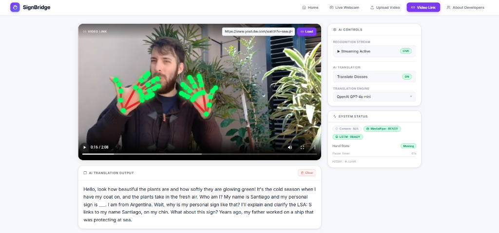
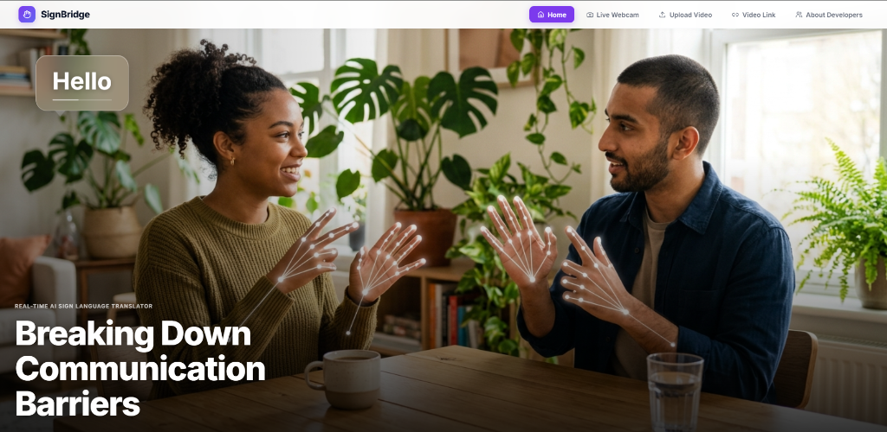
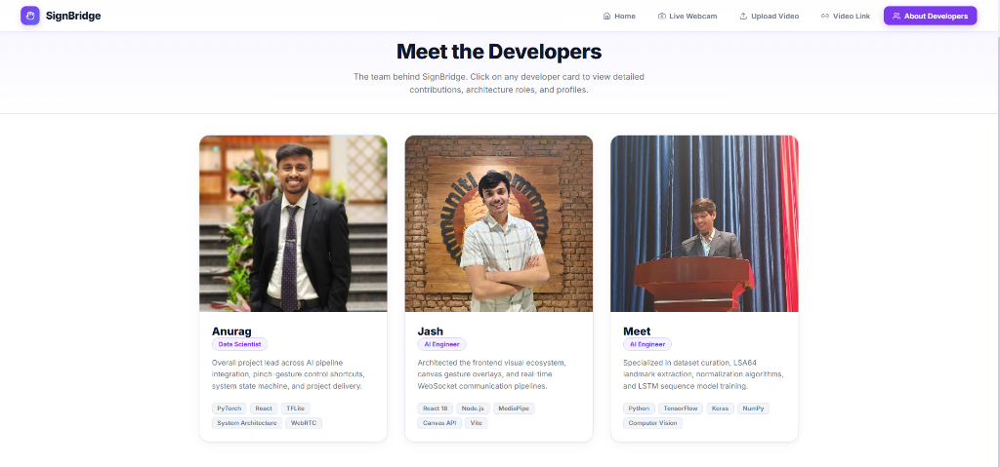
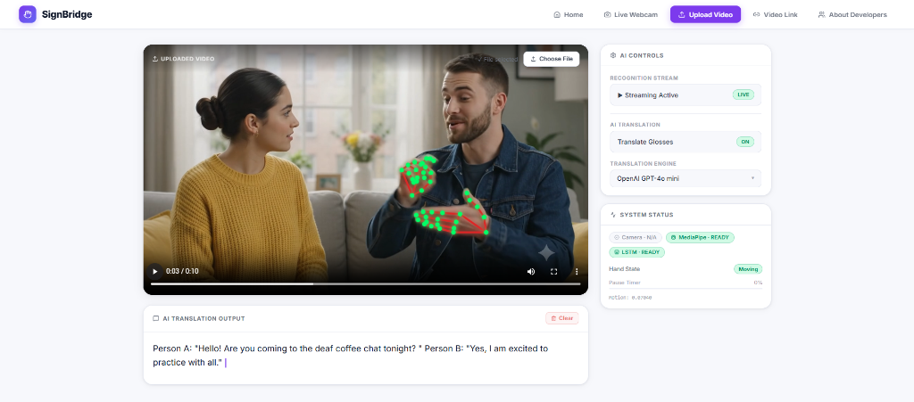
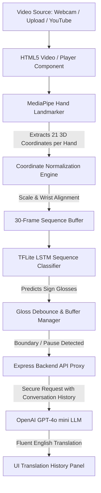

# SignBridge: Real-Time AI Sign Language Translator

SignBridge is an advanced, AI-powered communication bridge designed to break down barriers between the Deaf and Hard-of-Hearing communities and the hearing world. By extracting real-time hand landmarks from video feeds, the system processes gesture sequences through optimized deep learning models to predict sign glosses and translates them into fluent, context-aware English sentences using Large Language Models (LLMs).

---

## 🌟 Key Features

*   **Multi-Language Support**: Real-time translation of **ASL** (American Sign Language), **WSL** (Word-level ASL / WLASL), **ISL** (Indian Sign Language), and **ArSL** (Argentine Sign Language / LSA64).
*   **Three High-Performance Input Modes**:
    1.  **Live Webcam**: Interactive mirror-aligned camera feed with immediate local gesture predictions.
    2.  **Video Upload**: Support for local MP4/WebM files to translate pre-recorded sign dialogues.
    3.  **Video Link**: Resolves online streaming URLs (including YouTube video links) using a backend proxy resolver.
*   **Real-Time Landmark Visualization**: Precision canvas overlays render hand skeleton nodes and bone connections at 60 FPS.
*   **Word-by-Word Streaming Animation**: Simulates sequential model predictions with a fluid 260ms delay, letting the user watch the AI translate sign sequences live.
*   **Context-Aware Translation**: Automatically flushes sign gloss sequences to a GPT-4o mini pipeline to generate grammatical English sentences, maintaining active conversation context.

---

## 📸 Application Screenshots

### Cinematic Landing Page


### Video Link Playback (YouTube Proxy)


### Video Upload Translation (Deaf Coffee Chat)


### Meet the Developers


---

## ⚙️ System Architecture

The following diagram illustrates the data flow from raw video frame capture to landmark coordinate normalization, LSTM sequence classification, and GPT-4o mini translation:



---

## 🧠 Machine Learning & Data Pipeline

### 1. Hand Landmark Extraction & Normalization
*   **MediaPipe Hand Landmarker**: Extracts 21 3D coordinates `(x, y, z)` for each hand, representing joint nodes.
*   **Normalization**: Coordinates are transformed relative to the wrist landmark coordinates to make the model invariant to translation, scale, and user distance from the camera:
    $$X_{norm} = \frac{X - X_{wrist}}{Scale}$$

### 2. LSTM Sequence Classifier
*   **Model**: A Long Short-Term Memory (LSTM) recurrent neural network architecture designed to process time-series data.
*   **Sliding Window**: Evaluates gestures using a sliding window of 30 consecutive video frames.
*   **Weight File**: Loaded client-side via WebGL-accelerated TensorFlow.js (`lsa64_model.tflite`).

### 3. Training Datasets
*   **WLASL (Word-Level ASL)**: A comprehensive dataset containing thousands of ASL gloss videos for vocabulary learning.
*   **LSA64 (Argentine Sign Language)**: 3,200 videos of 64 distinct sign phrases performed by native signers under varied lighting conditions.
*   **ISL (Indian Sign Language)**: Curated landmark datasets for standard Indian Sign Language hand gestures.

### 4. LLM Translation
*   Raw predicted sign glosses are debounced and sent with the preceding translated sentence as history context to the **GPT-4o mini** engine, which infers word order, grammatical tenses, articles, and prepositions.

---

## 🌍 Social Impact & Inclusive Accessibility

For the Deaf and Hard-of-Hearing community, simple tasks like traveling, ordering food, or attending hearing schools can present significant communication barriers. 

SignBridge acts as a digital bridge:
*   **Independent Communication**: Empowers deaf signers to express themselves in their native sign language and have it immediately read aloud or displayed in fluent English to a hearing person.
*   **Adaptive Education**: Enables hearing classrooms or universities to accommodate deaf instructors and students without relying on expensive physical sign interpreters.
*   **Cross-Border Integration**: Multi-language support allows travelers to learn and translate regional sign dialects (like Argentine Sign Language) dynamically on-the-go.

---

## 🚀 Setup & Execution

### Prerequisites
*   Node.js (v18+)
*   Python 3.10+ (with `yt-dlp` package installed for YouTube stream resolving)

### Installation
1. Clone the repository:
   ```bash
   git clone https://github.com/AnuragChowdhury/sign-bridge.git
   cd sign-bridge
   ```
2. Install frontend and backend dependencies:
   ```bash
   npm install
   ```

### Running the App
Start both the React dev server (port 5173) and the Express proxy backend (port 3001) concurrently:
```bash
npm run dev:all
```
*   **Frontend**: `http://localhost:5173/`
*   **Backend Proxy**: `http://localhost:3001/`
