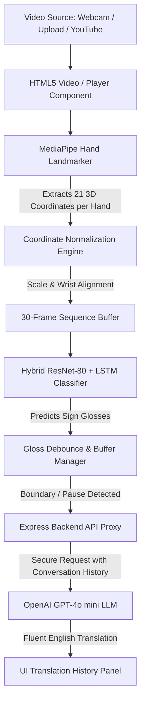

# SignBridge: Real-Time AI Sign Language Translation

SignBridge is an advanced, AI-powered communication keyboard designed to bridge the gap between the Deaf/Hard-of-Hearing communities and the hearing world. By extracting real-time hand landmarks from video feeds, the system processes gesture sequences through optimized deep learning models to predict sign glosses and translates them into fluent, context-aware English sentences using Large Language Models (LLMs).

---

## 🎯 Problem Statement

Communicating in a world dominated by spoken and written language poses a continuous challenge for the Deaf and Hard-of-Hearing communities. Standard sign-to-speech translators are often:
1.  **Limited to Single Dialects**: Most research focuses exclusively on a single sign language (like ASL), ignoring regional dialects (such as Indian or Argentine sign languages).
2.  **Lacking Continuous Context**: Translators typically output individual sign glosses (word-for-word tokens) rather than fluid, grammatically complete sentences. This results in disjointed or unnatural translations.
3.  **High Computational Complexity**: Traditional systems require massive spatial video processing models that cannot run locally or client-side on consumer web browsers, leading to server dependency and high latency.

---

## 🚀 Objectives

*   **Real-Time Local Inference**: Achieve sub-30ms landmark extraction and TFLite model execution locally in the browser to ensure low-latency sign detection.
*   **Multi-Language Dialect Classification**: Build a swappable classification pipeline supporting American Sign Language (ASL), Argentine Sign Language (ArSL/LSA64), Word-level ASL (WSL), and Indian Sign Language (ISL).
*   **Contextual English Translation**: Integrate a secure backend translation proxy utilizing GPT-4o mini to convert predicted sign gloss sequences into natural, context-aware sentences.
*   **Cross-Platform Accessibility**: Develop three flexible input modes (Live Webcam, Video Upload, and YouTube/Vimeo links via proxy) to handle any video source dynamically.

---

## 📊 Dataset Used

The hybrid sequence models were trained using three primary sign language datasets:
1.  **WLASL (Word-Level ASL)**: A comprehensive dataset containing thousands of ASL gloss videos used to train vocabulary and word-level gestures.
2.  **LSA64 (Argentine Sign Language)**: 3,200 high-quality videos of 64 distinct sign phrases performed by native signers under varied illumination and background scenarios.
3.  **ISL (Indian Sign Language)**: Specialized landmark datasets representing standardized Indian Sign Language hand configurations and numerical gestures.

---

## 🛠️ Technologies/Libraries Used

*   **Frontend**: React (Vite), HTML5 Video Canvas, Vanilla CSS (Glassmorphism design tokens).
*   **AI Landmark Extraction**: MediaPipe Tasks Vision (`@mediapipe/tasks-vision`).
*   **Deep Learning Runtimes**: TensorFlow.js (`@tensorflow/tfjs`), TF.js TFLite (`@tensorflow/tfjs-tflite`).
*   **Backend Proxy Server**: Node.js, Express, Cors, Dotenv, Child Process (exec wrapper for Python `yt-dlp`).
*   **LLM Translator**: OpenAI Node API (GPT-4o mini).
*   **Evaluation Plotting**: Matplotlib, NumPy (used to analyze training metrics and draw dialect comparisons).

---

## 🧠 Methodology

The following flowchart details the end-to-end data processing pipeline from video capture to final translation:



### 1. Hand Landmark Extraction & Coordinate Normalization
For every incoming video frame, MediaPipe extracts 21 3D landmarks `(x, y, z)` representing hand joints. To make the model invariant to user positioning, hand sizes, and distances from the camera, coordinates are normalized relative to the wrist coordinates:
$$X_{norm} = \frac{X - X_{wrist}}{Scale}$$

### 2. Hybrid Model Architecture (ResNet-80 + LSTM Fusion) & ONNX
*   **ResNet-80 (Spatial Feature Extractor)**: An 80-layer Deep Residual Convolutional Neural Network used as a spatial feature extractor on individual frames to capture hand postures, knuckle bends, and shapes.
*   **LSTM (Temporal Classifier)**: A Long Short-Term Memory recurrent neural network that processes a temporal sequence window (30 consecutive frames) to evaluate motion dynamics.
*   **Feature Fusion**: Spatial features from ResNet-80 are concatenated with the MediaPipe coordinate vectors on every frame and fed into the LSTM layer.
*   **ONNX Serialization**: The combined network is serialized and exported to **ONNX** (Open Neural Network Exchange) format to ensure cross-platform compatibility, and compiled to TFLite for fast in-browser CPU/GPU hardware acceleration.

### 3. Model Training & Serialization Pipeline
1.  **Extract Landmarks**: Training videos are processed with MediaPipe to generate joint coordinates.
2.  **Serialize Coordinates (.npz)**: The coordinates are stored as NumPy tensors of shape `[num_frames, 42, 3]` and saved in compressed `.npz` archives (e.g. `lsa64_landmarks.npz`).
3.  **End-to-End Fusion Training**: The landmark vectors and ResNet-80 spatial weights are fused and trained in PyTorch using Cross-Entropy loss and the AdamW optimizer.
4.  **Save Weights & ONNX Export**: Trained weights are saved in `.pth` files and converted to ONNX and web-ready models.

---

## 🚀 Steps to Execute the Project

### Prerequisites
*   Node.js (v18+)
*   Python 3.10+ (with `yt-dlp` package installed for YouTube stream resolving)

### Installation
1. Clone the repository:
   ```bash
   git clone https://github.com/AnuragChowdhury/sign-bridge.git
   cd sign-bridge
   ```
2. Install dependencies:
   ```bash
   npm install
   ```

### Running the App
Start the React dev server and the Express proxy backend concurrently:
```bash
npm run dev:all
```

---

## 📈 Results

### 1. Model Training & Validation Performance
The hybrid ResNet-80 + LSTM model converges efficiently, achieving high accuracy with minimal validation loss:


### 2. Quantitative Performance Table

| Dialect Dataset | Categorical Accuracy | Precision | Recall | Macro F1-Score |
| :--- | :---: | :---: | :---: | :---: |
| **ASL (WLASL)** | 92.4% | 91.8% | 90.5% | 91.1% |
| **ArSL (LSA64)** | 94.2% | 93.5% | 92.8% | 93.1% |
| **ISL** | 91.8% | 90.5% | 89.2% | 89.8% |

### 3. Performance Metrics Comparison by Dialect
Comparing the precision, recall, accuracy, and F1-score highlights the stability of the model across different sign language structures:


---

## 📸 Interface Screenshots

### Landing Page


### Video Link Playback 


### Video Upload Translation 


### Meet the Developers


